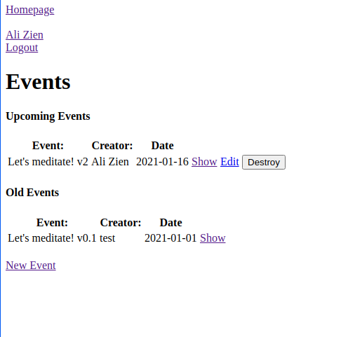

## Members-only

In this project, we are building an event management application that publish events and allow users to attend!
First you need to create an account to create an event or to attend an event.
Be aware of the event date, If it's older than today's date then it will be an old event and you won't be able to attend.
The creator of the event is automatically assigened to the attendance list.

## Screenshot

## Built With

- Ruby
- Rails
- devise
- Rspec
- Capybara

## Getting Started

### Prerequisites

Computer running Mac OS, Windows, or Linux Ubuntu.
Internet browser: Firefox, Google Chrome, Opera...

[Install Ruby](https://www.theodinproject.com/courses/ruby-programming/lessons/installing-ruby-ruby-programming)
[Install Rails](https://www.theodinproject.com/courses/ruby-on-rails/lessons/your-first-rails-application-ruby-on-rails)

### Setup

git clone https://github.com/AbdelrhmanAmin/Private-Events.git
cd Private-Events
bundle install
rails db:migrate
rails server
open in browser localhost:3000

## Authors

**Mir Rawshan Ali**

- GitHub: [@sumon0002009](https://github.com/sumon0002001)
- Twitter: [@sumon0002009](https://twitter.com/Sumon0002009)
- LinkedIn: [Mir Rawshan Ali](https://www.linkedin.com/in/mir-rawshan-ali-27b6a5198/)

😎 **Abdo Amin**

- GitHub: [@Abdelrhman-Amin](https://github.com/AbdelrhmanAmin)
- Twitter: [@Abdo Amin](https://twitter.com/AbdoAmi60489112)
- LinkedIn: [@Abdo Amin](https://www.linkedin.com/in/abdo-amin-ab786a1b0/)

## 🤝 Contributing

Contributions, issues, and feature requests are welcome!
Feel free to check the issues page https://github.com/AbdelrhmanAmin/Private-Events/issues

## Show your support

Give a :star:️ if you like this project!
