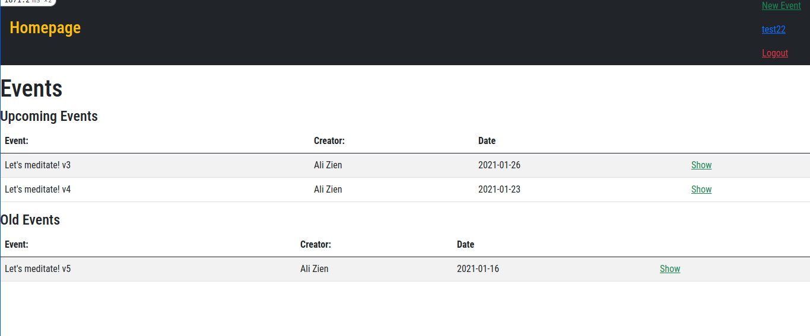

## Members-only

The project is based on Rails Asociations. If a user is logged in will have the ability to create a new events and Invite users to that event, if the user is not logged in he won't be able to

## Screenshot

## Built With

- Ruby
- Rails
- devise
- Rspec
- Capybara
- Bootstrap
- SQLite3

## Getting Started

### Prerequisites

Computer running Mac OS, Windows, or Linux Ubuntu.
Internet browser: Firefox, Google Chrome, Opera...

- Ruby 2.7.0
- Rails gem
- Bundle

[Install Ruby](https://www.theodinproject.com/courses/ruby-programming/lessons/installing-ruby-ruby-programming)
[Install Rails](https://www.theodinproject.com/courses/ruby-on-rails/lessons/your-first-rails-application-ruby-on-rails)

### Setup

Open terminal

- `git clone https://github.com/AbdelrhmanAmin/Private-Events.git`
- `cd Private-Events`
- `bundle install`
- `rails db:migrate`
- `rails server`  

open in browser `localhost:3000`

### TESTING

- make sure to run `bundle install`
- to test, run this on the console: `rspec spec/ -filename-.rb`

## Authors

😎 **Abdo Amin**

- GitHub: [@Abdelrhman-Amin](https://github.com/AbdelrhmanAmin)
- Twitter: [@Abdo Amin](https://twitter.com/AbdoAmi60489112)
- LinkedIn: [@Abdo Amin](https://www.linkedin.com/in/abdo-amin-ab786a1b0/)

## 🤝 Contributing

Contributions, issues, and feature requests are welcome!
Feel free to check the issues page https://github.com/AbdelrhmanAmin/Private-Events/issues

## Show your support

Give a star if you like this project!
